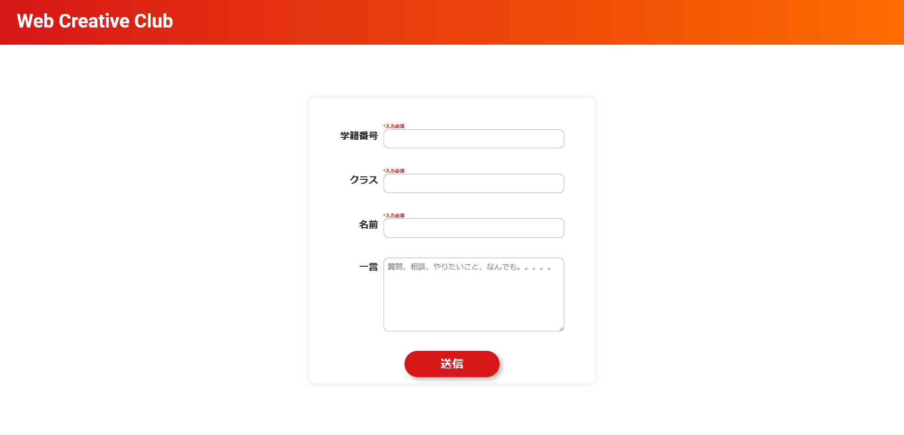
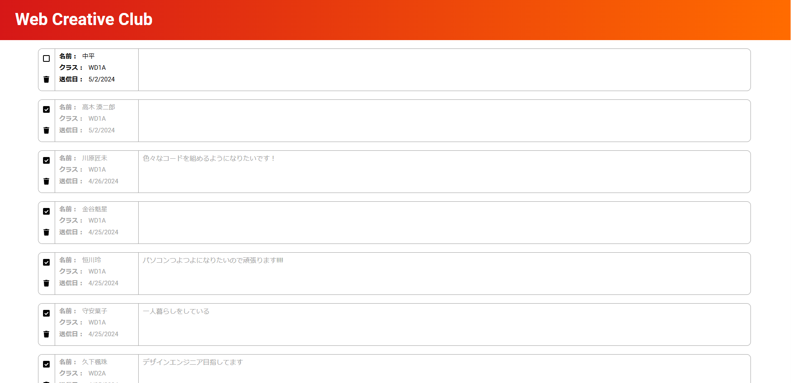

[英語版](README.en.md)

# W2C アンケートフォーム

これは、React と Firebase を使用して構築されたアンケートフォームアプリケーションです。これは TypeScript を使用する初めてのプロジェクトです。

<p align="center">
  
</p>
<p align="center">
  
</p>

## はじめに

このプロジェクトは、[Create React App](https://github.com/facebook/create-react-app) でブートストラップされました。

## 前提条件

- Node.js
- npm

## インストール

1. リポジトリをクローンします:

```sh
git clone https://github.com/yourusername/w2c-survey-form.git
```

2．依存関係をインストールします:

```sh
npm install
```

3. ルートディレクトリに .env ファイルを作成し、Firebase の構成詳細を記入します:

```sh
REACT_APP_FIREBASE_API_KEY=yourapikey
REACT_APP_FIREBASE_AUTH_DOMAIN=yourauthdomain
REACT_APP_FIREBASE_DATABASE_URL=yourdatabaseurl
REACT_APP_FIREBASE_PROJECT_ID=yourprojectid
REACT_APP_FIREBASE_STORAGE_BUCKET=yourstoragebucket
REACT_APP_FIREBASE_MESSAGING_SENDER_ID=yourmessagingsenderid
REACT_APP_FIREBASE_APP_ID=yourappid
```

## 使用技術

- [React](https://reactjs.org/)
- [Firebase](https://firebase.google.com/)
- [React Router DOM](https://reactrouter.com/web/guides/quick-start)
